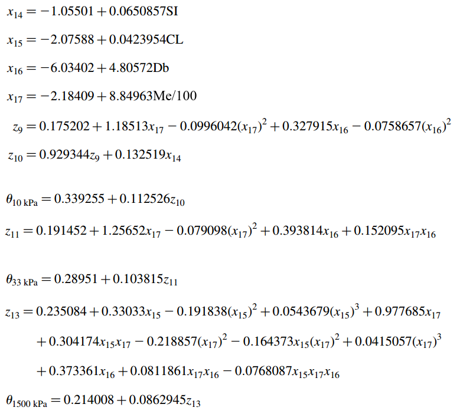

## Atividade 2

Exercício 1:
```{r}
1+1
100:130
5-+1
3%%5
2*3
4-1
6/(4-1)
```

Como 3 % 5 não é uma operação aceita pelo R, foi substituída por 3%%5.

Exercício 2:
Escolha um número e some 3 a ele
```{r}
5+3

```
Multiplique o resultado por 2
```{r}
(5+3)*2
```
Subtraia 10 da resposta

```{r}
(5+3)*2-10
```

Divida o que foi obtido por 4
```{r}
((5+3)*2-10)/4
```

Exercício 3: Calcule $\sqrt(16),\  16^{0.5^{3}},\ (16^{0.5})^{3}$ e $4^{\frac{3}{2}}$
```{r}
sqrt(16)
16**((0.5)**3)
(16**0.5)**3
4*(3/2)
```
Exercício 4: Teste as expressões $log10(1000),log(1000), e^{log(1000)}$. Depois teste a expressão $\log2(64)$. Verifique se você entendeu as diferentes funções logarítmicas.
```{r}
log10(1000)
log(1000)
exp(log(1000))
```
```{r}
log2(64)
```
Quando não atribui-se algum número na frente do termo log, o R aplica o logarítmo neperiano (na base e). 
```{r}
```


```{r}
v_luz <- 2.998e8
carga_elementar <- 1.602e-19
permissividade_vacuo <- 8.85e-12
k_planck <- 6.626e-34
k_stefan_boltzman <- 5.67e-8
k_solar <- 1380
k_avogrado <- 6.022e23
k_gases_ar_seco <- 287.04
k_gases_vapor <- 461.5
densidade_ar_seco <- 1.2754
atm <- 1013.25
temp_mar <- 288.15
calor_latente_vaporizacao <- 2.501e6
calor_latente_fusao <- 0.334e6
m_mol_h2o <- 18.016e-3
m_mol_ar <- 28.96e-3
v_angular_terra <- 7.29e-5


```
Exercício 6:a) Como você pode fazer para que a constante pi seja mostrada com 20 dígitos?(b) Como voltar a trabalhar a com 7 dígitos novamente?c. Mostre o npumero neperiano com 7 dígitos.
```{r}
options(digits = 20)
getOption("digits")
pi
options(digits = 7)
getOption("digits")
pi
exp(1)
```
Exercício 7: Determine a temperatura de bulbo úmido ($T_{w}$) usando a expressão empírica abaixo. Salve os resultados em variáveis diferentes. Determine a $T_{w}$ para temperatura do ar $T=20°C$ e umidade relativa $UR=70%$? Defina variáveis para os valores de T e UR solicitados e substitua-os na equação $T_{w}$. Não é necessária a conversão dos dados expressos em % para aplicação na equação.
$$T_{w} = T \cdot \arctan(0.151977 \cdot (UR + 8.313659)^{1 / 2}) +$$
$$\arctan(T + UR) - \arctan(UR - 1.676331) + 0.00391838 \cdot(UR^{3 / 2}) \cdot arctan(0.023101 \cdot UR) - 4.686035$$
```{r}
temp<-20
umidade_r<-70

```

```{r}
temp_bulbo_umido <- temp * atan(0.151977 * (umidade_r + 8.313659)**(1 / 2)) + 
atan(temp + umidade_r) - atan(umidade_r - 1.676331) + 
  0.00391838 * (umidade_r**(3 / 2)) * atan(0.023101 * umidade_r) - 4.686035
temp_bulbo_umido

```
Exercício 8: Determine os valores de umidade do solo:

no potencial hídrico de 10kPa ($\theta_{10kPa}$);

na capacidade de campo($\theta_{33kPa}$);

no ponto de murcha permanente($\theta_{1500kPa}$);

utilizando o conjunto de equações de pedotransferência abaixo

```{r, echo=FALSE}

```


Considere $SI=16.29$(%), $CL=49.25$(%), $Db=1.25(gcm^{-3})$,$Me=25(%)$, onde SI é a porcentagem de sile no solo, CL é a porcentagem de argila, Db é a densidade do solo e Me é a umidade quivalente em %. Não é necessária a conversão dos dados expressos em % para aplicação nas equações.
```{r}
silte <- 16.29
argila <- 48.25
densidade_solo <- 1.25
umidade_equiv <- 25

```


```{r}
x14 <- -1.05501 + 0.0650857 * silte
x15 <- -2.07588 + 0.0423954 * argila
x16 <- -6.03402 + 4.80572 * densidade_solo
x17 <- -2.18409 + (8.84963 * umidade_equiv) / 100
z9 <- 0.175202 + 1.18513 * x17 - 0.0996042 * (x17**2) + 0.327915 * x16 - 0.0758657 * (x16**2)
z10 <- 0.929344 * z9 + 0.132519 * x14
z11 <- 0.191452 + 1.25652 * x17 - 0.079098 * (x17**2) + 
  0.393814 * x16 + 0.152095 * x17 * x16
z13 <- 0.235084 + 0.33033 * x15 - 0.191838 * (x15**2) +
  0.0543679 * (x15**2) + 0.977685 * x17 + 0.304174 * x15 * x17 - 0.218857 * (x17**2) - 0.164373 * x15 * (x17**2) + 0.0415057 * (x17**3) + 0.373361 * x16 
+ 0.0811861 * x17 * x16 - 0.0768087 * x15 * x17 * x16
potencial_hidrico_10kpa <- 0.339255 + 0.112526 * z10
potencial_hidrico_10kpa
capacidade_campo <- 0.28951 + 0.103815 * z11
capacidade_campo
ponto_murcha_permanente <- 0.214008 + 0.0862945 * z13
ponto_murcha_permanente

```

Exercício 9:Arredonde para 2 casas decimais os resultados da equação 8. Dica ver ?round.
```{r}
round(x = potencial_hidrico_10kpa, digits = 2)
round(x = capacidade_campo, digits = 2)
round(x = ponto_murcha_permanente, digits = 2)
```

Exercício 10: Instale a **última versão do R** no (seu) computador usado para resolução da lista. Crie um *script* chamado `solucao-q10-NomeDoAluno.R` contendo os cógigos geradps para solução das questões 7 e 8. Faça as seguintes alterações no código do *script*:

* no códio da questão 8, utilize a temperatura do ar ($T$) de 30°C e Umidade relativa ($UR$) de 30% para calcular $T_{w}$.

* no código da questão 9, considere $SI = 13 (\%)$, $CL = 37 (\%),\ Db = 1.3gcm^{-3},\ Me = 21(\%)$ para recalcular  $\theta_{10kPa}$, $\theta_{33kPa}$ e $\theta_{1500kPa}$.

* após os códigos usados para resolver as questões 8 e 9, adicione uma nova linha com a expressão `sessionInfo()`.

* Finalmente rode o `script` usando o R no modo não iterativo. Anexe o arquivo de saída `solucao-q10-NomdeDoAluno.Rout` como resposta para este problema.

